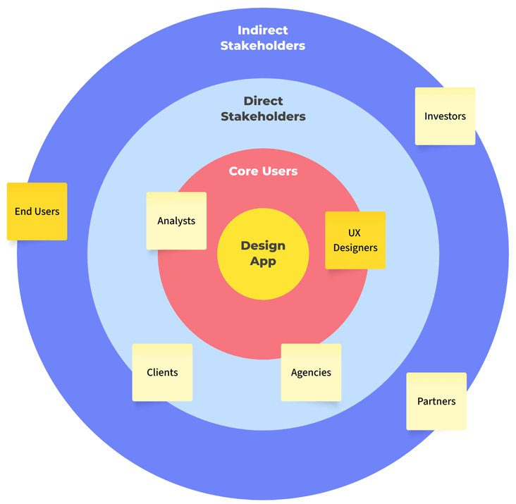
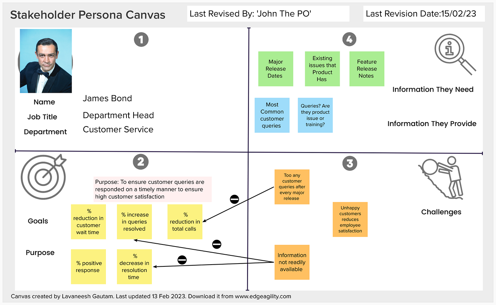
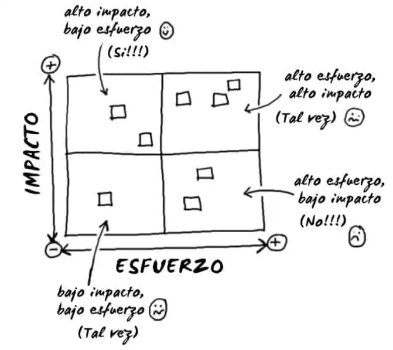
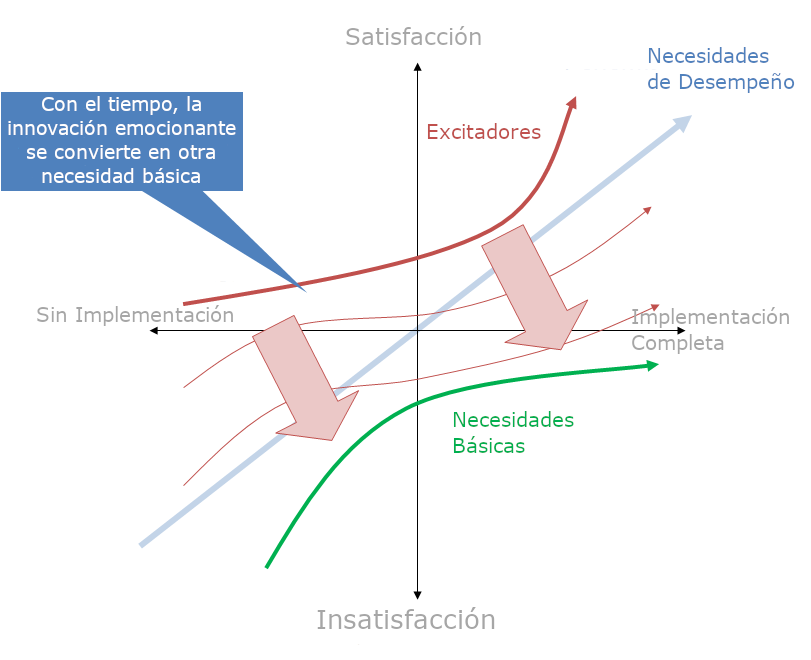

# Clase 2: Ingeniería de Requerimientos
_Ingeniería de Software I_

---

## Objetivos de la clase

- Comprender qué son los requerimientos en ingeniería de software y su rol en el ciclo de desarrollo
- Reconocer los distintos tipos de requerimientos y las formas tradicionales de clasificarlos
- Identificar *stakeholders* y aplicar técnicas para la extracción efectiva de requerimientos
- Redactar y evaluar requerimientos claros, verificables y trazables

---

## ¿Qué es un requerimiento?

- Los requerimientos son cualquier factor que afecte el diseño del sistema
- Una condición o capacidad que un sistema debe satisfacer para cumplir con una necesidad
- Una especificación de lo que debe ser implementado. Son descripciones de cómo el sistema debe comportarse, o de una propiedad o atributo del sistema. Pueden ser una restricción en el proceso de desarrollo del sistema

<small class="muted">**Ejemplos:** "El sistema debe permitir registro con email" pero también "El sistema debe ser capaz de manejar 1000 usuarios concurrentes" y "El sistema debe cumplir con la legislación de protección de datos argentina"</small>

---

## Tipos clásicos de requerimientos

- **Requerimientos funcionales**
  Definen comportamientos, funciones, servicios

- **Requerimientos no funcionales**
  Definen restricciones de calidad o condiciones del entorno

- **Requerimientos de dominio / restricciones**
  Provienen del entorno o regulaciones externas

---

## Requerimientos funcionales

Un requerimiento que define un comportamiento específico del sistema. Describe lo que el sistema debe hacer.

En metodologías ágiles, se suelen expresar como *user stories*.

  <b>Ejemplo:</b> el sistema debe permitir a los usuarios registrarse con su email

---

## Requerimientos no-funcionales

Un requerimiento que define una propiedad o restricción del sistema, pero no un comportamiento específico. Asociados generalmente a los "atributos de calidad".

Suelen ser los más difíciles de definir y cumplir, pero son los más importantes a la hora de diseñar la arquitectura del sistema.

  <b>Ejemplo:</b> el sistema debe ser capaz de procesar pagos en menos de 500ms para el 99% de los casos

---

## Atributos de calidad (algunos ejemplos)

- **Rendimiento**: tiempo de respuesta, throughput, escalabilidad
- **Usabilidad**: facilidad de uso, accesibilidad
- **Seguridad**: autenticación, autorización, confidencialidad
- **Mantenibilidad**: facilidad de mantenimiento, modularidad
- **Portabilidad**: facilidad de adaptación a otros entornos
- **Interoperabilidad**: capacidad de interactuar con otros sistemas
- **Confiabilidad**: disponibilidad, tolerancia a fallos
- **Escalabilidad**: capacidad de crecer sin perder rendimiento
---

## Por qué esta clasificación es útil

- Es el estándar en documentación técnica y plantillas formales (ej. IEEE 830)
- Facilita la organización y trazabilidad
- Es requerida en auditorías, licitaciones, contratos
- Útil para roles específicos: testers, arquitectos, legales

---

## Pero... ¿y si esta división es artificial?

- Tomemos como ejemplo un sistema de trading de alta frecuencia, el requerimiento como "El sistema debe procesar 1000 transacciones por segundo" es tan funcional como cualquier otro.
- Para una persona que usa un lector de pantalla, el requerimiento "El sistema debe ser accesible" es tan funcional como "El sistema debe permitir registro con email".
- Lo "no funcional" suele ser más crítico y difícil de cumplir, a pesar de que suele quedar relegado a un segundo plano.

---

## Actividades de la Ingeniería de Requerimientos

Conforman el proceso estructurado que permite transformar necesidades en especificaciones claras, gestionables y validables.

---

## Actividades de la Ingeniería de Requerimientos

1. **Extracción o elicitación**
   Identificación de requerimientos y stakeholders
   Técnicas: entrevistas, workshops, observación, etc.

2. **Análisis**
  Comprensión y organización de los requerimientos
  Técnicas: modelado, prototipado, análisis de impacto

3. **Especificación**
   Redacción formal de los requerimientos
   Técnicas: plantillas, casos de uso, *user stories*, diagramas

---

## Actividades de la Ingeniería de Requerimientos

4. **Validación**
   Asegurar que los requerimientos reflejan las necesidades reales
   Técnicas: revisiones, prototipos, pruebas de aceptación, etc.

5. **Gestión**
   Control de cambios, trazabilidad y priorización
   Técnicas: herramientas de gestión de requerimientos, matrices de trazabilidad

---

## Stakeholders

- Personas o grupos que **afectan o son afectadas** por el sistema
- No sólo usuarios finales: también incluyen patrocinadores, soporte, legales, IT, testers, reguladores, etc.
- Cada uno tiene necesidades y expectativas diferentes

> 🧠 “Todo stakeholder tiene una perspectiva diferente del valor del sistema. Ignorar alguna puede ser costoso.”

---

## Tipos de stakeholders

- **Internos** vs. **Externos**
- **Operativos**: usuarios directos
- **Gerenciales**: responsables de decisiones y presupuesto
- **Técnicos:** IT, arquitectura, seguridad
- **Indirectos**: legales, reguladores, soporte, marketing

---

## Riesgos de una mala gestión de stakeholders

- Requerimientos incompletos o contradictorios
- Cambios de alcance tardíos
- Falta de validación o aceptación del producto
- Decisiones basadas en suposiciones erróneas

---

## Técnicas para identificar stakeholders

- **Entrevistas iniciales** y mapeo organizacional
- **Stakeholder map**: ubicación según influencia/interés
- **Personas**: arquetipos que resumen motivaciones y necesidades
- **Workshops colaborativos**: para alinear expectativas

---

<!-- _class: blank  -->

## Mapa de stakeholders

Basado en círculos concentricos

---

<!-- _class: blank  -->

---

<!-- _class: blank  -->
<!-- _paginate: "" -->

---

## Buenas prácticas para la gestión de stakeholders

- Involucrar a los stakeholders desde el inicio
- Documentar quién dijo qué (trazabilidad)
- Mantener una comunicación continua y adaptativa
- Gestionar conflictos de prioridades con transparencia

---

## Extracción de requerimientos

- Es el proceso de descubrir, recopilar y entender los requerimientos desde las partes interesadas
- No se trata sólo de recoger pedidos, sino de interpretar necesidades reales, a menudo tácitas o no articuladas

> 🧠 “Los usuarios raramente saben lo que quieren… hasta que ven algo que no funciona como esperaban.”

---

## Por qué es difícil la extracción de requerimientos

- Los stakeholders no siempre tienen claro lo que necesitan
- Expresan soluciones, no problemas (ej: “Quiero un botón para exportar a Excel” → ¿para qué?)
- Uso de lenguaje ambiguo o contradictorio
- Suposiciones tácitas o conocimientos tribales
- Conflictos entre diferentes áreas o roles

---

## Técnicas principales de extracción

1. **Entrevistas**
    Abiertas o estructuradas
    Clave: escuchar más que hablar, preguntar “¿por qué?” varias veces
2. **Workshops o talleres**
    Sesiones colaborativas (ej. Design Sprint, Event Storming)
    Permiten alinear a varias personas al mismo tiempo
3. **Observación directa (etnografía ligera)**
    Ver cómo los usuarios realmente interactúan con el sistema actual
    Detecta necesidades que no mencionan explícitamente

---

## Técnicas principales de extracción

4. **Cuestionarios y encuestas**
    Útiles para escalar información cuando hay muchos usuarios
5. **Análisis de documentos existentes**
    Manuales, procesos actuales, formularios, bases de datos
6. **Prototipos / maquetas / wireframes**
    Permiten validar ideas rápido y revelar requerimientos ocultos
7. **Historias de usuario y ejemplos concretos**
    Pedirle al stakeholder que “cuente cómo haría algo”

---

## Buenas prácticas

- Prepararse: conocer el dominio y el contexto del negocio
- Confirmar lo entendido: repetir, reformular, prototipar
- Incluir stakeholders diversos para evitar sesgos
- Documentar decisiones, no solo pedidos

> 🧠 “La extracción efectiva es más parecida a una investigación periodística que a llenar un formulario.”

---

## Características de requerimientos efectivos

- **Completo**: incluye toda la información necesaria para entenderlo
- **Correcto**: describe con precisión la necesidad real que el sistema debe satisfacer
- **Viable**: puede ser implementado dentro de las capacidades y limitaciones del sistema y del proyecto
- **Necesario**: realmente necesario para el negocio o el usuario
- **Priorizado**: tiene una importancia clara y definida
- **No-ambigüo**: no da lugar a múlti ples interpretaciones
- **Verificable (testable)**: cuenta con criterios claros de aceptación

---

## Análisis de requerimientos

- Involucra alcanzar una comprensión más precisa y rica de cada requerimiento y representar los requerimientos de diferentes maneras.
- Incluye la identificación de dependencias, conflictos y prioridades
- Permite detectar requerimientos redundantes, innecesarios o faltantes
- Técnicas: modelos, diagramas de flujo, casos de uso, prototipos, etc.

---

## Características de un buen conjunto de requerimientos

- **Completo**: no están ausentes requerimientos o información necesaria
- **Consistente**: los requerimientos no deben contradecirse entre sí
- **Trazable**: un requerimiento debe poder ser rastreado a su origen y a su implementación
- **Modificable**: los requerimientos deben poder ser modificados y guardar un registro de los cambios

---

## Validación de requerimientos

- Es el proceso de asegurar que los requerimientos reflejan correctamente las necesidades reales de los stakeholders.

- Responde a la pregunta: ¿Esto es lo que realmente necesitamos?

- Se realiza antes (y durante) el desarrollo para evitar retrabajos costosos.

> 🧠 “Más del 50% de los errores en proyectos de software se deben a requerimientos mal definidos o no validados.” (IEEE)

---

## Buenas prácticas de validación

- Validar con los usuarios correctos (no solo con el cliente interno)
- Incluir validación en Definition of Done
- Validar requerimientos complejos con casos de uso o prototipos
- Documentar acuerdos (quién aprueba qué y cuándo)

---

## Gestión de requerimientos

- Es el conjunto de prácticas y herramientas para organizar, rastrear, priorizar y controlar cambios en los requerimientos

- Su objetivo es mantener la alineación entre lo que se necesita, lo que se construye y lo que se entrega

> 🧠 “El problema no es que los requerimientos cambien, sino no estar preparados para gestionarlos.”

---

## Trazabilidad de requerimientos

- Capacidad de rastrear cada requerimiento desde su origen hasta su implementación, prueba y despliegue.

- Para esto se usan herramientas como Jira, Trello, Linear, ClickUp, etc.

- En algunos casos también puede ser importante la trazabilidad inversa: desde el código hasta el requerimiento que lo originó.

---

## Priorización de requerimientos

Métodos comunes:
- **MoSCoW**: Must, Should, Could, Won't
- **Valor vs. Esfuerzo**: matriz de priorización
- **Kano**: Satisfiers, Dissatisfiers, Delighters

> 🎯 Una correcta priorización no es solo técnica: también política y estratégica

---

---

---

## Gestión de cambios

- Los cambios en requerimientos son inevitables
- Necesitan tener un **proceso** claro:
  - Quién puede solicitar cambios
  - Cómo se analiza su impacto
  - Cómo se aprueba y versiona

---

## Una visión alternativa: requerimientos como hipótesis

- En lugar de ver los requerimientos como verdades absolutas, considerarlos como hipótesis de negocio/producto a validar
- Permite adoptar un enfoque más científico al desarrollo de software

> 🧪 “Creemos que X… lo sabremos si Y”

---

## Resumen

- Los requerimientos son fundamentales para el éxito de un proyecto de software
- Existen distintos tipos de requerimientos y formas de clasificarlos
- La gestión de stakeholders es clave para la extracción efectiva de requerimientos
- La trazabilidad, priorización y gestión de cambios son esenciales para mantener el control
- La validación de requerimientos es crucial para evitar retrabajos y asegurar que se cumplen las necesidades reales

---

## Recursos para profundizar

- "Software Requirements"
  3rd Edition, Karl Wiegers & Joy Beatty

